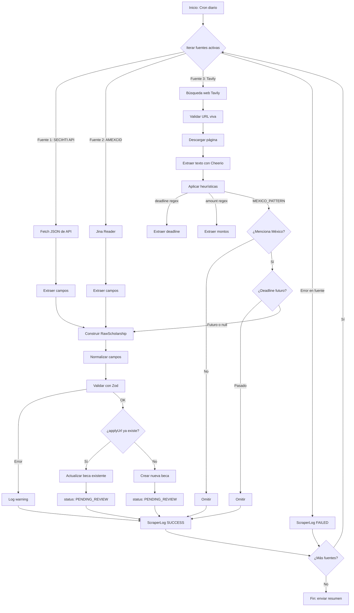

# Arquitectura de BecaHub

> Documentación de arquitectura del proyecto BecaHub. Última actualización: 9 de octubre, 2026.

## Tabla de contenidos

- [Visión general](#visión-general)
- [Decisiones técnicas principales](#decisiones-técnicas-principales)
- [Módulos del sistema](#módulos-del-sistema)
- [Diagramas](#diagramas)
- [Modelo de datos](#modelo-de-datos)
- [Flujos principales](#flujos-principales)
- [Infraestructura y despliegue](#infraestructura-y-despliegue)
- [Seguridad y cumplimiento legal](#seguridad-y-cumplimiento-legal)
- [Riesgos y limitaciones](#riesgos-y-limitaciones)
- [Fases de desarrollo](#fases-de-desarrollo)
- [Bitácora de cambios](#bitácora-de-cambios)

---

## Visión general

BecaHub es una plataforma para estudiantes mexicanos, principalmente universitarios, que buscan becas en México y en el extranjero. El objetivo es centralizar la información de oportunidades de becas, facilitar la búsqueda con filtros y recomendaciones, y permitir que los estudiantes gestionen su perfil y postulaciones en un solo lugar.

### Objetivos

- **Audiencia:** estudiantes mexicanos buscando becas nacionales e internacionales
- **Tamaño esperado a 1 año:** menos de 500 usuarios
- **Costo:** cero o casi cero, solo Supabase Free (sin Groq, Tavily ni Vercel en producción)
- **Monetización:** aún no se decide, pero el campo `isFeatured` en el modelo de becas permite destacar convocatorias en el futuro
- **Alertas:** no implementadas por ahora, pero el modelo de datos está preparado para agregarlas

### Filosofía de diseño

- **Simplicidad primero:** el estudiante llena su perfil una sola vez y no repite datos para cada beca
- **Postulación ligera:** no hay formularios por beca en BecaHub; el botón "Postular" abre el portal oficial de la beca y el estudiante puede marcar "ya postulé" para llevar el seguimiento
- **Validación de fuentes:** todas las becas publicadas tienen su URL verificada y responden con código 200
- **Sin inteligencia artificial en el pipeline de becas:** desde la Fase 6, ningún LLM toca el descubrimiento ni el scraping; la extracción de fechas, montos y filtros México/vigente se hace con expresiones regulares y heurísticas

---

## Decisiones técnicas principales

### Stack tecnológico

- **Framework:** Next.js 16 (App Router, estructura `src/`)
- **Lenguaje:** TypeScript estricto
- **UI:** Tailwind CSS + shadcn/ui (preset Nova, iconos Lucide)
- **Base de datos:** PostgreSQL (Supabase Free, pooler Supavisor puerto 6543)
- **ORM:** Prisma 7 con driver adapters (`@prisma/adapter-pg`)
- **Autenticación (planeado):** Supabase Auth (migración desde NextAuth v4 pendiente)
- **Validación:** Zod v4
- **Scraping:** Cheerio, Playwright (sin browsers descargados todavía)
- **Despliegue:** Netlify Free (planeado), con vistas previas por PR

### Decisiones arquitectónicas clave

1. **Capa de servicios en `/api/v1`:** toda la lógica de negocio vive en endpoints REST versionados, pensando en que la futura app nativa (Expo) pueda reutilizarlos sin duplicar código
2. **Sin IA en la ingesta de becas:** la extracción de deadline, montos y filtro México se hace con regex (`src/scrapers/discovery/heuristics.ts`). Los campos que no se pueden determinar con confianza quedan `null` para revisión del admin
3. **Invariante de `applyUrl`:** siempre es una URL real que pasó la validación de link vivo (`checkUrlHealth()`), nunca inventada ni decidida por un modelo de IA
4. **Row-Level Security futura:** Prisma usa un usuario administrador que se salta la seguridad por fila, por eso TODAS las lecturas y escrituras de perfil, favoritos, postulaciones y documentos pasan por una sola capa de servicios que exige el usuario de la sesión
5. **Búsqueda sin IA:** texto completo de Postgres en español que ignore acentos; recomendaciones por reglas de nivel académico, área, país y promedio mínimo

---

## Módulos del sistema

### 1. Catálogo y búsqueda

**Descripción:** permite a los estudiantes explorar becas con filtros (país, nivel académico, área, tipo de cobertura, fecha de cierre) y búsqueda por texto completo.

**Rutas:**
- `/becas` — listado con filtros, paginación, búsqueda
- `/becas/[slug]` — detalle de una beca

**Componentes principales:**
- `src/components/scholarships/ScholarshipCard.tsx`
- `src/components/scholarships/FilterPanel.tsx`
- `src/components/scholarships/SearchBar.tsx`

**Lógica:**
- `src/lib/becas/queries.ts` — `getBecas()`, `getBecaBySlug()`, `getFeaturedBecas()`
- `src/lib/becas/recommend.ts` — `recomendarBecas()` (filtro por perfil del estudiante)

**Estado actual:** ✅ completado (Fase 4A + Fase 7)

---

### 2. Ingesta de becas

**Descripción:** tarea diaria en GitHub Actions que obtiene becas de fuentes oficiales, normaliza, deduplica y guarda como `PENDING_REVIEW` para aprobación de un moderador.

**Fuentes planeadas:**
- **API JSON de SECIHTI** (`secihti.mx/wp-json/wp/v2/convocatoria`, categorías 265 y 266) — pendiente de implementar
- **Jina Reader** para AMEXCID, COMEXUS (Fulbright), Santander, DAAD — pendiente de implementar
- **Exa** como opción para descubrir becas nuevas — pendiente de implementar
- **Tavily Discovery** (prototipo funcional, `TavilyDiscoveryAdapter`) — búsqueda web con filtro México/vigente

**Pipeline:**
1. Un lector por fuente como módulo aislado (`src/scrapers/adapters/`)
2. Normalizar con `src/scrapers/normalize.ts` (mapea sinónimos de cobertura, nivel académico, país)
3. Validar con Zod
4. Quitar duplicados por `applyUrl`
5. Guardar como `PENDING_REVIEW` con `isVerified: false`
6. Un moderador aprueba y publica desde `/admin`

**Ejecución:**
- `npm run scrape` (manual)
- `npm run discover` (Tavily)
- `POST /api/admin/scraper/ejecutar` (admin)
- `POST /api/admin/scraper/descubrir` (Tavily desde admin)
- GitHub Actions cron (pendiente de configurar)

**Estado actual:** ⏳ base completa (Fase 3), Tavily funcional sin LLM (Fase 6), lectores de fuentes específicas pendientes

---

### 3. Revisión (admin y moderadores)

**Descripción:** panel `/admin` para curar becas scrapeadas, aprobar para publicación, editar, archivar y verificar links.

**Rutas:**
- `/admin/login` — autenticación provisional con cookie (password único en `ADMIN_PASSWORD`)
- `/admin/becas` — listado de becas con filtro por estado
- `/admin/becas/nueva` — crear beca manualmente
- `/admin/becas/[id]/editar` — editar beca existente

**Endpoints:**
- `GET /api/admin/becas` — listado
- `POST /api/admin/becas` — crear
- `PUT /api/admin/becas` — editar completo
- `PATCH /api/admin/becas` — cambio rápido de estado (`DRAFT`/`ACTIVE`/`CLOSED`)
- `POST /api/admin/becas/[id]/reverify` — re-verificar link (archiva automáticamente si cayó)
- `POST /api/admin/becas/validar-url` — validar URL antes de publicar

**Roles:**
- `ADMIN`: puede aprobar becas, administrar usuarios y fuentes
- `MODERATOR`: puede aprobar becas, pero no administrar usuarios ni fuentes (pendiente de implementar)
- `USER` (estudiantes): sin acceso al panel

**Validación de publicación (`assertCanPublish`):**
- País de destino debe incluir "México" (`MEXICO_PATTERN`)
- `deadline` presente y en el futuro (`>= hoy`)
- URL viva según `checkUrlHealth()` (responde 200, no es soft-404)

**Estado actual:** ⏳ CRUD completo (Fase 4B), autenticación provisional por cookie, rol `MODERATOR` en el enum pero sin lógica diferenciada implementada

---

### 4. Cuentas y perfil

**Descripción:** registro, inicio de sesión y perfil del estudiante. El perfil se puede llenar manualmente o con ayuda de un asistente conversacional (Groq).

**Rutas:**
- `/perfil` — formulario manual (pendiente de implementar)
- `/perfil/asistente` — chat con asistente de IA que hace preguntas y construye el perfil
- `/dashboard` — tablero del estudiante (skeleton, sin datos reales todavía)

**Asistente de perfil:**
- `src/lib/ai/profile-assistant.ts` — `chatWithAssistant(messages)`
- Hace una pregunta a la vez en español
- Cuando tiene suficiente información, devuelve `profileReady: true` + `ProfileDraft`
- Endpoints: `POST /api/perfil/asistente` (chat), `POST /api/perfil` (guardar)

**Autenticación planeada:**
- **Migrar de NextAuth v4 a Supabase Auth**
- Prisma tiene los modelos `User`, `Account`, `Session` (compatibles con `@auth/prisma-adapter`)
- `User.id` será el id de Supabase Auth
- Row-Level Security de Supabase protegerá los datos por usuario

**Estado actual:** ⏳ asistente funcional con Groq (Fase 6), autenticación real pendiente, `POST /api/perfil` acepta `userId` en el body de forma interina

---

### 5. Expediente y postulaciones

**Descripción:** el estudiante sube documentos comunes una sola vez (INE, CURP, comprobante de domicilio, kárdex) y BecaHub le muestra qué requisitos tiene cubiertos para cada beca.

**Flujo de postulación:**
1. El estudiante ve una beca de interés
2. Puede marcar "Me interesa" (guarda en `Application` con estado `INTERESTED`)
3. Al hacer clic en "Postular", se abre el portal oficial de la beca en otra pestaña
4. A un lado aparecen sus datos listos para copiar con un clic, sus documentos y los requisitos que tiene o le faltan
5. Los documentos vencidos según su fecha de emisión se marcan como "te falta subir uno actualizado"
6. Al regresar, marca "Ya postulé" y la beca pasa a su tablero con estado `APPLIED`

**Estados de postulación (`ApplicationStatus`):**
- `INTERESTED` — me interesa
- `APPLIED` — enviada
- `INTERVIEW` — entrevista
- `AWARDED` — ganada
- `REJECTED` — rechazada

**Modelos nuevos (pendientes de migración):**
- `Requirement` — tipo de documento y vigencia máxima en días (ej. INE: 10 años, comprobante de domicilio: 90 días)
- `StudentDocument` — tipo, fecha de emisión y archivo en bucket privado de Supabase Storage
- `Consent` — versión de términos y aviso aceptados, fecha
- `AuditLog` — registro de acciones críticas

**Almacenamiento:**
- Supabase Storage (Free: 1 GB)
- Archivos privados con enlaces firmados que caducan en 10 minutos o menos
- Máximo 2 MB por archivo (fotos comprimidas en el celular)
- Aviso al usuario al llegar al 70 % del storage

**Estado actual:** ⏳ modelos existentes (`Favorite`, `Application`), nuevos modelos pendientes de migración, UI del expediente pendiente

---

### 6. Legal (términos, privacidad)

**Descripción:** términos y condiciones y aviso de privacidad conforme a la LFPDPPP (Ley Federal de Protección de Datos Personales en Posesión de los Particulares).

**Requisitos:**
- Un abogado debe revisar ambos documentos antes de recibir documentos reales de los estudiantes
- Sin aceptar los términos y el aviso, no se pueden subir documentos
- El modelo `Consent` registra qué versión aceptó cada usuario y cuándo

**Acciones del usuario:**
- Descargar todos sus datos (GDPR-style)
- Borrar la cuenta (elimina perfil, datos y archivos del bucket de Storage)

**Estado actual:** ⏳ modelo `Consent` pendiente de migración, documentos legales pendientes de redacción

---

## Diagramas

### Diagrama de módulos

```mermaid
graph TB
    subgraph "Frontend Público"
        A[Home / Landing]
        B[Catálogo /becas]
        C[Detalle /becas/slug]
        D[Solicitud /solicitud-beca]
    end

    subgraph "Frontend Autenticado"
        E[Dashboard /dashboard]
        F[Perfil /perfil]
        G[Asistente /perfil/asistente]
        H[Expediente]
        I[Postulaciones]
    end

    subgraph "Admin"
        J[Panel /admin]
        K[Curación de becas]
        L[Gestión de fuentes]
    end

    subgraph "API v1"
        M[/api/v1/becas]
        N[/api/v1/perfil]
        O[/api/v1/postulaciones]
        P[/api/v1/documentos]
    end

    subgraph "Capa de Servicios"
        Q[queries.ts]
        R[recommend.ts]
        S[admin.ts]
    end

    subgraph "Base de Datos"
        T[(PostgreSQL Supabase)]
    end

    subgraph "Ingesta"
        U[GitHub Actions Cron]
        V[Scraper Adapters]
        W[Normalización]
        X[Dedup]
    end

    subgraph "Almacenamiento"
        Y[Supabase Storage]
    end

    A --> B
    B --> C
    B --> M
    C --> M
    E --> N
    F --> N
    G --> N
    H --> P
    I --> O
    J --> K
    K --> S
    M --> Q
    N --> Q
    O --> Q
    P --> Q
    Q --> T
    R --> T
    S --> T
    U --> V
    V --> W
    W --> X
    X --> T
    P --> Y
```

### Diagrama de flujo de ingesta



---

## Modelo de datos

### Modelos principales

#### User

```prisma
model User {
  id            String    @id @default(uuid())
  email         String    @unique
  name          String?
  image         String?
  emailVerified DateTime?
  password      String?
  role          Role      @default(USER)
  country       String?
  academicLevel AcademicLevel?
  createdAt     DateTime  @default(now())
  updatedAt     DateTime  @updatedAt

  accounts      Account[]
  sessions      Session[]
  favorites     Favorite[]
  applications  Application[]
  notifications Notification[]
  profile       Profile?
}
```

**Nota:** `User.id` será el id de Supabase Auth tras migrar la autenticación.

---

#### Scholarship

```prisma
model Scholarship {
  id                 String            @id @default(uuid())
  title              String
  slug               String            @unique
  description        String
  status             ScholarshipStatus @default(DRAFT)
  coverageType       CoverageType
  amountMin          Decimal?
  amountMax          Decimal?
  currency           String            @default("MXN")
  countryOrigin      String?
  countryDestination String
  academicLevel      AcademicLevel
  language           String?
  deadline           DateTime?
  applyUrl           String
  sourceId           String
  isVerified         Boolean           @default(false)
  isFeatured         Boolean           @default(false)
  scrapedAt          DateTime?
  createdAt          DateTime          @default(now())
  updatedAt          DateTime          @updatedAt

  source       Source
  categories   ScholarshipCategory[]
  favorites    Favorite[]
  applications Application[]
}
```

**Estados posibles (`ScholarshipStatus`):**
- `ACTIVE` — publicada, visible para estudiantes
- `DRAFT` — borrador, no visible
- `PENDING_REVIEW` — scrapeada, pendiente de aprobación
- `CLOSED` — fecha pasada, archivada

**Tipos de cobertura (`CoverageType`):**
- `MONETARY` — manutención mensual
- `TRAVEL` — viaje
- `TUITION` — colegiatura
- `SPORTS` — deportiva
- `RESEARCH` — investigación
- `LEADERSHIP` — liderazgo
- `FULL` — todo incluido

---

#### Profile

```prisma
model Profile {
  id              String          @id @default(uuid())
  userId          String          @unique
  academicLevel   AcademicLevel?
  fieldOfInterest String?
  countryOrigin   String?
  countryInterest String?
  scholarshipTypes CoverageType[]
  language        String?
  situation       String?
  goals           String?
  createdAt       DateTime        @default(now())
  updatedAt       DateTime        @updatedAt

  user User
}
```

**Relación 1:1 con `User`.** Alimenta las recomendaciones de `recomendarBecas()`.

---

#### Application

```prisma
model Application {
  id            String            @id @default(uuid())
  userId        String
  scholarshipId String
  status        ApplicationStatus @default(INTERESTED)
  notes         String?
  appliedAt     DateTime?
  updatedAt     DateTime          @updatedAt

  user        User
  scholarship Scholarship

  @@unique([userId, scholarshipId])
}
```

**Estados (`ApplicationStatus`):**
- `INTERESTED` — me interesa
- `APPLIED` — enviada
- `INTERVIEW` — entrevista
- `AWARDED` — ganada
- `REJECTED` — rechazada

---

#### Source

```prisma
model Source {
  id             String     @id @default(uuid())
  name           String
  url            String
  type           SourceType
  isActive       Boolean    @default(true)
  scraperAdapter String?
  lastScrapedAt  DateTime?
  createdAt      DateTime   @default(now())

  scholarships Scholarship[]
  scraperLogs  ScraperLog[]
}
```

**Tipos (`SourceType`):**
- `GOVERNMENT` — gubernamental (ej. SECIHTI)
- `EDUCATIONAL` — instituciones educativas
- `NGO` — organizaciones sin fines de lucro
- `SOCIAL` — redes sociales / comunidades
- `MANUAL` — curación manual desde `/admin`
- `DISCOVERY` — descubrimiento automático (Tavily, Exa)

---

#### ScraperLog

```prisma
model ScraperLog {
  id           String           @id @default(uuid())
  sourceId     String?
  status       ScraperRunStatus @default(RUNNING)
  itemsFound   Int              @default(0)
  itemsCreated Int              @default(0)
  itemsUpdated Int              @default(0)
  itemsSkipped Int              @default(0)
  errorMessage String?
  startedAt    DateTime         @default(now())
  finishedAt   DateTime?
  durationMs   Int?

  source Source?
}
```

**Estados (`ScraperRunStatus`):**
- `RUNNING` — en progreso
- `SUCCESS` — completado sin errores
- `PARTIAL` — completado con algunos errores
- `FAILED` — falló completamente

---

### Modelos pendientes de migración

Estos modelos están documentados pero aún no existen en el schema de Prisma:

#### Requirement

```prisma
model Requirement {
  id          String   @id @default(uuid())
  name        String
  type        String
  maxAgeDays  Int?
  description String?
  createdAt   DateTime @default(now())
}
```

Ejemplo: `{ name: "INE", type: "IDENTIFICACION", maxAgeDays: 3650 }` (10 años).

---

#### StudentDocument

```prisma
model StudentDocument {
  id          String   @id @default(uuid())
  userId      String
  type        String
  fileName    String
  storageKey  String
  issuedAt    DateTime?
  uploadedAt  DateTime @default(now())

  user User
}
```

`storageKey` apunta a un archivo en Supabase Storage (bucket privado).

---

#### Consent

```prisma
model Consent {
  id              String   @id @default(uuid())
  userId          String
  termsVersion    String
  privacyVersion  String
  acceptedAt      DateTime @default(now())

  user User
}
```

---

#### AuditLog

```prisma
model AuditLog {
  id        String   @id @default(uuid())
  userId    String?
  action    String
  entity    String
  entityId  String?
  metadata  Json?
  createdAt DateTime @default(now())

  user User?
}
```

---

## Flujos principales

### 1. Flujo de descubrimiento e ingesta de becas (sin LLM)

1. **Cron diario en GitHub Actions** ejecuta `npm run scrape` o `npm run discover`
2. Cada adapter (`BecasGobAdapter`, `TavilyDiscoveryAdapter`) realiza:
   - Búsqueda/scraping de la fuente
   - Validación de URL viva (`checkUrlHealth()` o `validateUrlIsLive()`)
   - Extracción de texto con Cheerio (`<main>` o selectores específicos)
   - Construcción de `RawScholarship` con **heurísticas regex**:
     - `extractDeadlineRaw()` busca patrones de fecha en español
     - `extractAmountRaw()` busca montos tipo "$1,000 MXN"
     - Filtro México: descarta si no matchea `MEXICO_PATTERN`
     - Filtro vigente: descarta si el deadline ya pasó
3. Normalización (`normalize()`) mapea sinónimos de `coverageType`, `academicLevel`, `country`
4. Deduplicación por `applyUrl` (upsert)
5. Guardar como `PENDING_REVIEW` con `isVerified: false`
6. Crear `ScraperLog` con conteos (`itemsFound`, `itemsCreated`, `itemsUpdated`, `itemsSkipped`)

**Invariante crítico:** el campo `applyUrl` siempre es la URL real que se fetcheó y validó como viva, nunca una URL generada por un modelo de IA.

---

### 2. Flujo de curación (admin)

1. **Moderador/admin accede a `/admin/becas`** (protegido por cookie `ADMIN_PASSWORD`)
2. Ve listado de becas con filtro por `status` (`PENDING_REVIEW`, `DRAFT`, `ACTIVE`, `CLOSED`)
3. Para cada beca `PENDING_REVIEW`:
   - Puede editar campos manualmente
   - Verificar link con "Validar URL" (`POST /api/admin/becas/validar-url`)
   - Publicar (cambia `status` a `ACTIVE`) solo si pasa `assertCanPublish`:
     - País incluye México
     - Tiene `deadline` en el futuro
     - URL viva (no soft-404)
   - O guardar como `DRAFT` para completar después
4. Las becas `ACTIVE` pueden ser archivadas manualmente (`CLOSED`) o automáticamente si `POST /api/admin/becas/[id]/reverify` detecta que el link cayó

---

### 3. Flujo de construcción de perfil con asistente (Groq)

1. **Estudiante accede a `/perfil/asistente`**
2. Inicia conversación con `chatWithAssistant([])` (`POST /api/perfil/asistente`)
3. El asistente (Groq) hace **una pregunta a la vez en español**:
   - "¿Qué carrera estudias?"
   - "¿A qué país te gustaría ir?"
   - "¿Cuál es tu situación económica?"
   - "¿Cuáles son tus metas académicas?"
4. El estudiante responde en lenguaje natural
5. El asistente asesora brevemente ("podrías calificar para becas de manutención...")
6. Cuando tiene suficiente información, responde `profileReady: true` + `profile` (JSON con `academicLevel`, `fieldOfInterest`, `countryOrigin`, `countryInterest`, `scholarshipTypes`, `language`, `situation`, `goals`)
7. La UI muestra el perfil propuesto y el estudiante confirma "Guardar perfil"
8. Se envía `POST /api/perfil` para guardar en la DB

**Degradación:** si Groq no responde (503), el estudiante puede llenar el perfil manualmente en `/perfil`.

---

### 4. Flujo de postulación (estudiante)

Este flujo aún no está implementado. El diseño planeado es:

1. **Estudiante ve detalle de una beca** (`/becas/[slug]`)
2. Puede marcar **"Me interesa"** → guarda `Application` con estado `INTERESTED`
3. Al hacer clic en **"Postular"**:
   - Se abre el portal oficial de la beca (`applyUrl`) en otra pestaña
   - A un lado aparece un panel con:
     - Datos del estudiante listos para copiar (nombre, email, CURP, etc.)
     - Documentos que tiene cargados y puede descargar
     - Requisitos de la beca con indicadores:
       - ✅ "Ya lo tienes" (documento del tipo requerido, vigente)
       - ⏰ "Vencido" (documento del tipo requerido, pero su fecha de emisión excede la vigencia máxima)
       - ❌ "Te falta" (no tiene documento de ese tipo)
4. Al regresar, marca **"Ya postulé"** → cambia el estado de `Application` a `APPLIED` con `appliedAt: now()`
5. La beca aparece en su tablero `/dashboard` con seguimiento del estado (`APPLIED`, `INTERVIEW`, `AWARDED`, `REJECTED`)

---

### 5. Flujo de recomendaciones

1. **Estudiante completa su perfil** (manual o con asistente)
2. En `/dashboard` se llama a `recomendarBecas(profile, limit)`
3. El filtro actual es básico:
   - `academicLevel` del estudiante debe coincidir con `Scholarship.academicLevel`
   - `scholarshipTypes` del perfil debe incluir alguno de los `coverageType` de la beca
   - `countryInterest` del perfil debe coincidir con `Scholarship.countryDestination`
4. Ordenar por `deadline` ascendente (más urgentes primero)
5. Mejora futura planeada: scoring por área de interés, idioma, situación, promedio mínimo

---

## Infraestructura y despliegue

### Entorno de desarrollo

- Node.js 20+
- PostgreSQL local o Supabase (pooler puerto 6543 + puerto directo 5432 para migraciones)
- Variables de entorno en `.env.local`:
  ```env
  DATABASE_URL=      # pooled (Supavisor)
  DIRECT_URL=        # directo para migraciones
  GROQ_API_KEY=      # asistente de perfil
  GROQ_MODEL=        # default: llama-3.3-70b-versatile
  ADMIN_PASSWORD=    # acceso provisional al panel /admin
  NEXTAUTH_SECRET=   # genera con: openssl rand -base64 32
  NEXTAUTH_URL=http://localhost:3000
  ```

### Producción (planeado)

- **Hosting:** Netlify Free
- **Base de datos:** Supabase Free (1 GB PostgreSQL, autoscaling 2-10 GB)
- **Storage:** Supabase Storage Free (1 GB)
- **Limits:**
  - Máximo 2 MB por archivo de estudiante
  - Aviso al usuario al llegar al 70 % del storage (700 MB)
  - Compresión de fotos en el celular antes de subir

### CI/CD

- **GitHub Actions:**
  - Tests en cada PR: Vitest + Playwright contra un Postgres temporal (nunca contra producción)
  - Cron diario para ingesta de becas (pendiente de configurar)
  - Deploy automático de vistas previas por PR en Netlify
- Cada fuente de scraping se prueba contra una copia guardada de su respuesta (snapshots)

### Riesgos de infraestructura

1. **GitHub Actions desactiva cron tras 60 días sin actividad en el repo**
   - Mitigación: agregar un recordatorio en el calendario o usar un cron externo (ej. cron-job.org)
2. **Supabase Free se pausa tras una semana sin uso**
   - Mitigación: agregar un health check diario (`GET /api/health` con query básica a la DB)
3. **Límite de 1 GB en Storage**
   - Mitigación: avisar al usuario al 70 %, rechazar archivos > 2 MB, comprimir fotos

---

## Seguridad y cumplimiento legal

### Autenticación y autorización

- **Actual (provisional):** panel `/admin` protegido por cookie con password único (`ADMIN_PASSWORD`)
- **Planeado:** migrar a Supabase Auth
  - `User.id` será el id de Supabase Auth
  - Row-Level Security (RLS) de Supabase protegerá los datos por usuario
  - Roles: `STUDENT` (default), `MODERATOR` (aprueba becas), `ADMIN` (gestiona fuentes y usuarios)

### Protección de datos personales

**Prisma usa un usuario administrador que se salta la RLS**, por eso TODAS las lecturas y escrituras de perfil, favoritos, postulaciones y documentos deben pasar por una sola capa de servicios que exige el usuario de la sesión.

- Módulo `src/lib/auth.ts` (pendiente): helpers `requireUser(request)`, `requireRole(request, role)`
- Endpoints en `/api/v1/*` validan sesión y hacen queries con `{ where: { userId: session.user.id } }`

### Cumplimiento con LFPDPPP

La LFPDPPP (Ley Federal de Protección de Datos Personales en Posesión de los Particulares) aplica porque BecaHub recoge datos personales de estudiantes mexicanos.

**Requisitos:**
- **Aviso de privacidad** accesible antes de recabar datos, con lenguaje claro
- **Consentimiento explícito** para datos sensibles (documentos de identidad, datos académicos)
- **Derecho ARCO** (Acceso, Rectificación, Cancelación, Oposición):
  - Acceso: descargar todos los datos (JSON)
  - Rectificación: editar perfil
  - Cancelación: borrar cuenta (elimina perfil, datos, archivos del bucket)
  - Oposición: no implementado (no hay marketing ni terceros)
- **Límite de uso:** los datos solo se usan para el propósito declarado (recomendaciones, postulaciones)

**Estado actual:**
- Modelo `Consent` pendiente de migración
- Documentos legales (términos y condiciones, aviso de privacidad) pendientes de redacción
- **Un abogado debe revisarlos antes de recibir documentos reales de los estudiantes**

### Almacenamiento de archivos

- Todos los archivos de estudiantes van a un **bucket privado** de Supabase Storage
- Los enlaces son **firmados** y caducan en **10 minutos o menos**
- Formatos permitidos: PDF, JPG, PNG
- Tamaño máximo: 2 MB por archivo
- Al borrar la cuenta, se eliminan todos los archivos del bucket vía `storage.from('documentos').remove([...keys])`

---

## Riesgos y limitaciones

### Riesgos técnicos

1. **Fuentes de becas caen o cambian de estructura**
   - Ejemplo: `gob.mx/becasbenitojuarez` ahora responde 404 (cambio reciente)
   - Mitigación: `ScraperLog` registra fallas, panel `/admin` muestra aviso si no hubo corrida exitosa en 48 horas
   - `POST /api/admin/becas/[id]/reverify` archiva automáticamente becas cuyos links caen

2. **Groq (plan gratuito) puede devolver 429 bajo ráfagas**
   - Mitigación actual: el adapter omite ese ítem sin romper la corrida
   - Mejora futura: espaciar las llamadas o añadir retry/backoff

3. **Heurísticas de extracción pueden fallar**
   - `extractDeadlineRaw()` no detecta todas las formas de expresar una fecha límite
   - Mitigación: los campos `null` quedan para revisión del admin en `/admin`

4. **Sin alertas, los estudiantes pueden perder fechas límite**
   - Mitigación futura: agregar modelo `Alert` y enviar emails con Resend

### Riesgos de negocio

1. **Tamaño de audiencia incierto**
   - Proyección: < 500 usuarios en el primer año
   - Si crece más rápido, Supabase Free podría quedarse corto (1 GB de storage, límite de conexiones concurrentes)

2. **Monetización no definida**
   - Campo `isFeatured` permite destacar becas en el futuro (posible modelo de ingresos), pero no hay plan concreto

3. **Competencia con plataformas establecidas**
   - Existen agregadores de becas en México (Universia, Fundación UNAM)
   - Diferenciador planeado: UI/UX sencilla, recomendaciones personalizadas, app nativa

### Limitaciones actuales

1. **Sin autenticación real:** el panel `/admin` usa un password único provisional
2. **Sin expediente de documentos:** los modelos `Requirement`, `StudentDocument`, `Consent`, `AuditLog` no existen todavía
3. **Sin alertas:** el usuario no recibe recordatorios de fechas límite próximas
4. **Dashboard con datos mock:** `/dashboard` es un skeleton sin conexión a `Profile`/`recomendarBecas`
5. **Recomendaciones básicas:** solo filtran por nivel/cobertura/país, sin scoring por área de interés/idioma/situación

---

## Fases de desarrollo

Cada fase tiene criterios de éxito que se responden con **sí o no**.

### Fase 1: Base y despliegue ✅ COMPLETADA

1.1 El sitio está en Netlify y el listado carga en producción → ⏳ sitio no está en Netlify todavía, corre en local  
1.2 El registro y el inicio de sesión funcionan con Supabase Auth → ⏳ autenticación real pendiente  
1.3 Un usuario sin rol de admin o moderador recibe 403 en `/admin` → ✅ sí (via `proxy.ts`)  
1.4 Cada PR corre Vitest y Playwright contra un Postgres temporal → ⏳ CI pendiente de configurar  
1.5 Una beca con fecha de cierre pasada no aparece en el listado → ✅ sí (filtro `deadline >= today` en `getBecas`)  
1.6 Se resuelven o justifican las vulnerabilidades críticas de `next` y `next-auth` → ⏳ pendiente:
- Subir `next` a `>=16.4.0` (actualmente 16.2.9)
- `next-auth` desaparecerá completamente con la migración a Supabase Auth
- Revisar manualmente las vulnerabilidades de alta en `prisma` y `shadcn` (si las hay)  
1.7 En un clon nuevo, `npm install` seguido de `npm test` pasa sin pasos manuales → ⏳ pendiente: agregar `prisma generate` en `postinstall` o antes de las pruebas  

### Fase 2: Ingesta ✅ COMPLETADA (parcial)

2.1 Cada fuente tiene una prueba sobre una copia guardada de su respuesta → ⏳ no todas las fuentes tienen tests todavía  
2.2 Si una fuente falla, las demás siguen y la falla queda registrada como `FAILED` → ✅ sí  
2.3 Ninguna beca importada se publica sin aprobación → ✅ sí (todas quedan `PENDING_REVIEW`)  
2.4 La misma beca de dos fuentes queda como un solo registro → ✅ sí (dedup por `applyUrl`)  
2.5 Una beca sin fecha válida o con el enlace roto queda marcada para revisión → ✅ sí (quedará `deadline: null` o se omite si el link no pasa `validateUrlIsLive`)  
2.6 El panel muestra un aviso si no hubo una corrida exitosa en 48 horas → ⏳ pendiente en la UI de `/admin`  
2.7 Quitar o reemplazar código restante de Tavily y Groq → ⏳ pendiente:
- `src/lib/discovery/tavily.ts` (búsqueda web)
- `scripts/discover.ts` (comando `npm run discover`)
- `src/lib/ai/profile-assistant.ts` (asistente de perfil)
- Botón "Descubrir" en `/admin` (si existe)
- **Opción de reemplazo:** Exa para descubrimiento de becas  

### Fase 3: Perfil y búsqueda ✅ COMPLETADA (parcial)

3.1 Buscar "mexico" encuentra "Becas México" → ✅ sí (filtro `search` con `contains` insensible)  
3.2 Las recomendaciones no incluyen becas de otro nivel académico → ✅ sí (`recomendarBecas` filtra por `academicLevel`)  
3.3 Los favoritos y las postulaciones se guardan → ⏳ modelos existen, UI pendiente  
3.4 El estudiante A no puede leer ni cambiar nada del B, aunque cambie el id en la URL → ⏳ validación de sesión pendiente  

### Fase 4: Expediente y legal ⏳ PENDIENTE

4.1 Sin aceptar los términos y el aviso no se pueden subir documentos → ⏳ modelo `Consent` pendiente  
4.2 Los archivos son privados y su enlace firmado caduca en 10 minutos o menos → ⏳ integración con Supabase Storage pendiente  
4.3 Se rechazan los archivos que no sean PDF, JPG o PNG, o que pesen más de 2 MB → ⏳ pendiente  
4.4 El botón "Postular" abre el enlace oficial en otra pestaña, y ese enlace responde → ✅ sí (todas las becas `ACTIVE` tienen `applyUrl` verificado)  
4.5 Borrar la cuenta elimina el perfil, los datos y los archivos del bucket de Storage → ⏳ pendiente  
4.6 El estudiante puede descargar todos sus datos → ⏳ pendiente  
4.7 Un documento vigente del tipo que pide la beca aparece como "ya lo tienes"; uno faltante o caducado, como "te falta" → ⏳ pendiente  
4.8 Un documento con fecha de emisión más vieja que lo permitido aparece como vencido → ⏳ pendiente  
4.9 Marcar "ya postulé" lleva la beca al tablero con el estado "enviada" → ⏳ pendiente  

### Fase 5: Moderadores y API ⏳ PENDIENTE

5.1 Un moderador puede aprobar becas, pero no administrar usuarios ni fuentes → ⏳ rol `MODERATOR` existe, lógica diferenciada pendiente  
5.2 Cada aprobación queda en la bitácora → ⏳ modelo `AuditLog` pendiente  
5.3 Todo lo que usa la web está en `/api/v1`, con validación y pruebas → ⏳ endpoints actuales están en `/api`, no `/api/v1`  

### Después: App nativa, alertas y monetización

- App nativa con Expo (iOS y Android)
- Sistema de alertas por email (Resend)
- Definir y lanzar modelo de monetización (becas destacadas con `isFeatured`)

---

## Bitácora de cambios

Esta sección debe actualizarse en cada PR que modifique la arquitectura.

| Fecha | PR | Cambios |
|-------|----|----|
| 2026-10-09 | (este PR) | Documento `ARQUITECTURA.md` creado. Refleja el estado actual del proyecto tras Fase 0 (limpieza en `main`), Fase 1-3 (scraping, admin, landing), Fase 6 (Tavily sin LLM, Groq como asistente de perfil), Fase 7 (merge de `fronted`), Fase 8 (wizard `/solicitud-beca` + fix de `globals.css`). |

---

## Referencias

- [BITACORA.md](/workspace/BITACORA.md) — registro detallado de cada fase con hallazgos técnicos
- [CLAUDE.md](/workspace/CLAUDE.md) — reglas para agentes de IA que trabajan en este proyecto
- [README.md](/workspace/README.md) — guía rápida para configurar el entorno de desarrollo
- [Documentación de Prisma](https://www.prisma.io/docs) — ORM usado en el proyecto
- [Documentación de Supabase](https://supabase.com/docs) — PostgreSQL y Storage
- [LFPDPPP](https://www.diputados.gob.mx/LeyesBiblio/pdf/LFPDPPP.pdf) — Ley Federal de Protección de Datos Personales en Posesión de los Particulares

---

**Fin del documento.**

Este documento vive y crece con el proyecto. Cada PR que cambie la arquitectura debe actualizar la sección de bitácora al final.
